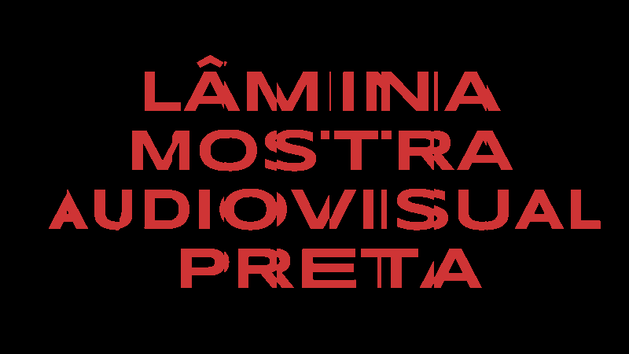

# TextSlicer

A [p5.js](https://p5js.org/) sketch to get some animated text slices.  

Made originally for the visual identity of **LÂMINA — Mostra Audiovisual Preta**.  
[Check the full design process on Behance](https://www.behance.net/gallery/122884567/LAMINA-Mostra-Audiovisual-Preta)  
[Check the website for more info about the film festival](http://www.mostralamina.com.br)  

## Example  

## Demo  

[werls.xyz](http://werls.xyz/demos/text-slicer)  
<!-- [OpenProcessing](https://openprocessing.org/sketch/1217904) -->

